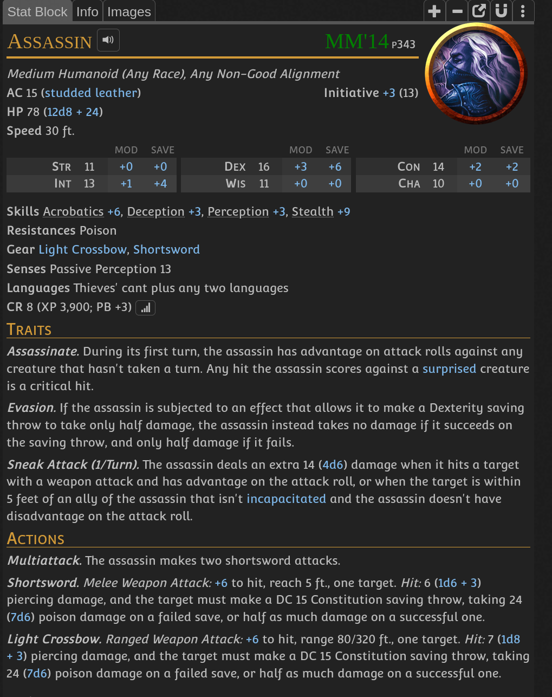
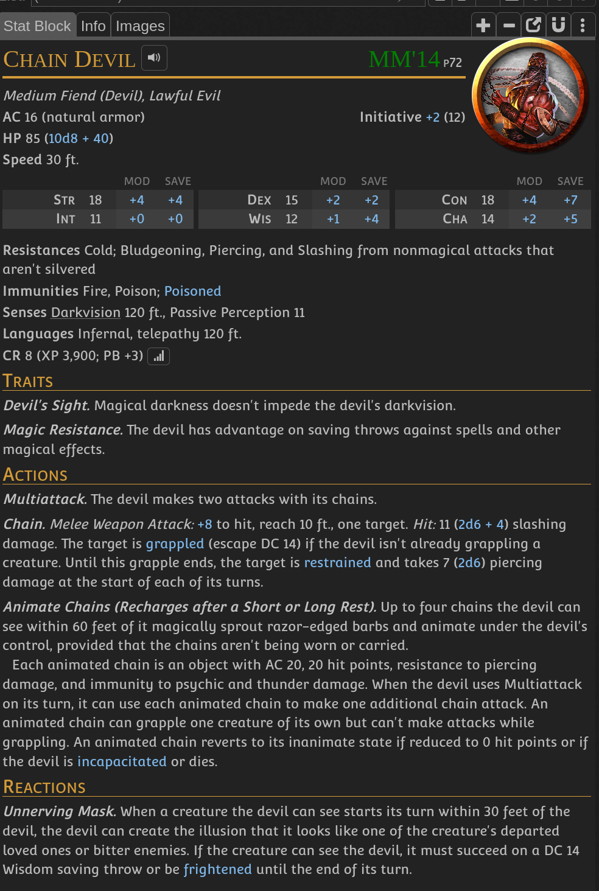
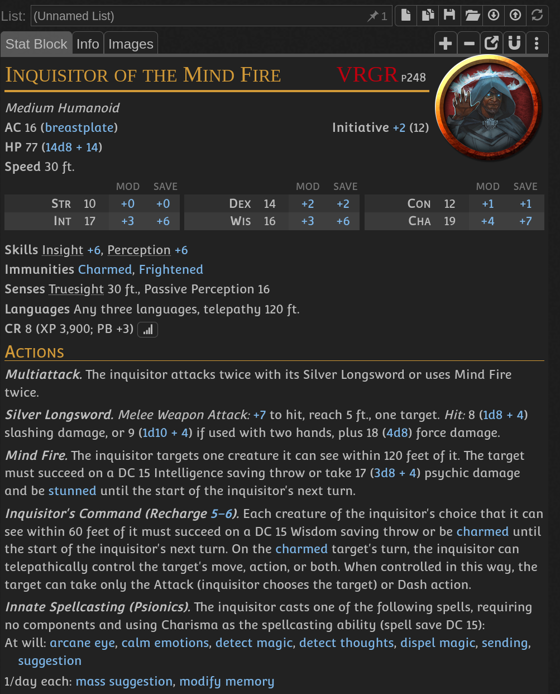
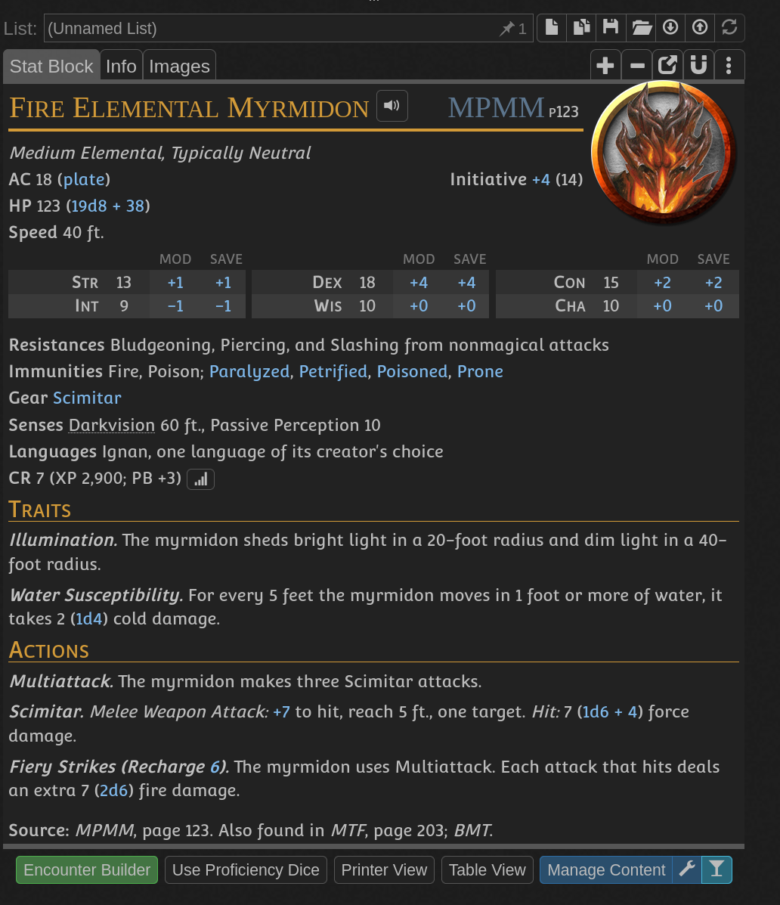
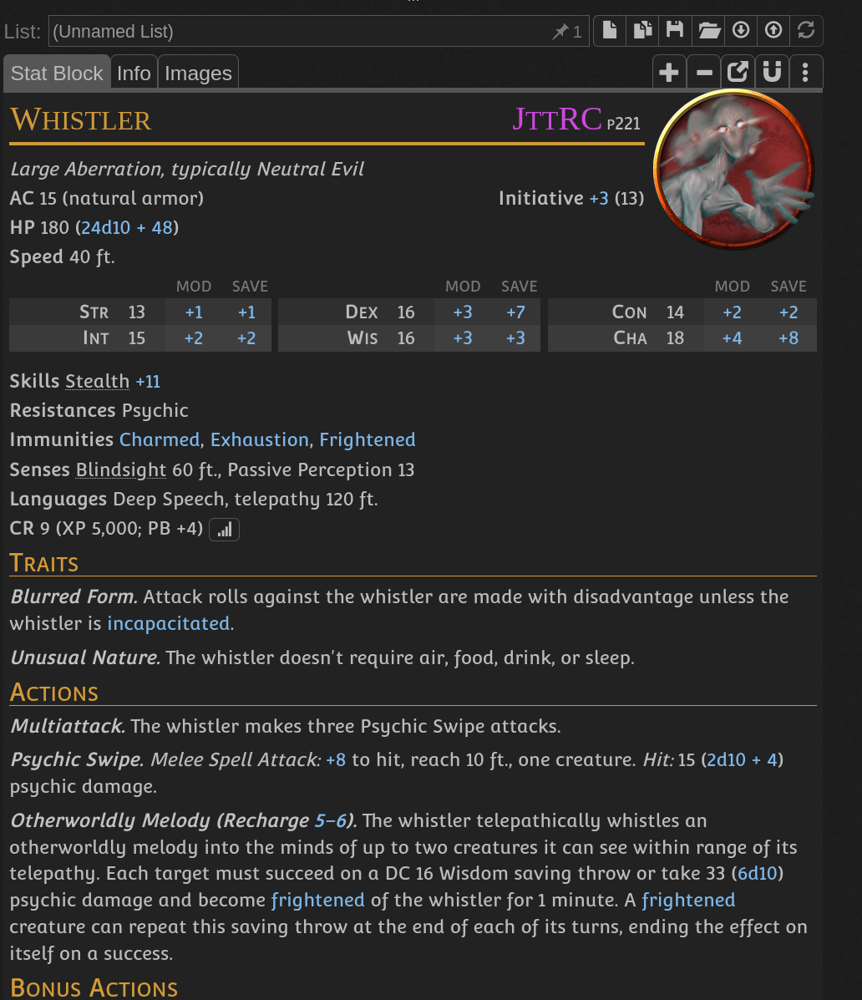

- See [[blue jam bottles quest]]
- Consists of 5 levels
	- 1st level - entrance, personal rooms, washing room with jars - 1400 small jars located here, dexterity(stealth) check if attract monsters or not
	- 2nd level - library, laboratory -
	- 3rd level - cages, operation room -
	- 4th level - incenerator and more cages -
	- 5th level - head master office and armory - contains manuscript describing [[Iron Claw legend]]
- Built to produce combat mutants through necromantic experiments
-
- The idea was to make a mutant that is capable of taking down mages, basically a mage killer
	- The creature has no eyes or ears, big mouth full of venomous teeth and sharp claws. It looks like humanoid with almost glowing white skin. It has not seen sun and despises it
	- soldier - close combat version - attacks with claws and teeth
	- 
	- werper - telekinetic monster, fully imune to magical attacks
	- 
	- psychonaut
	- 
	- fire mutant
	- 
	- 
	-
-