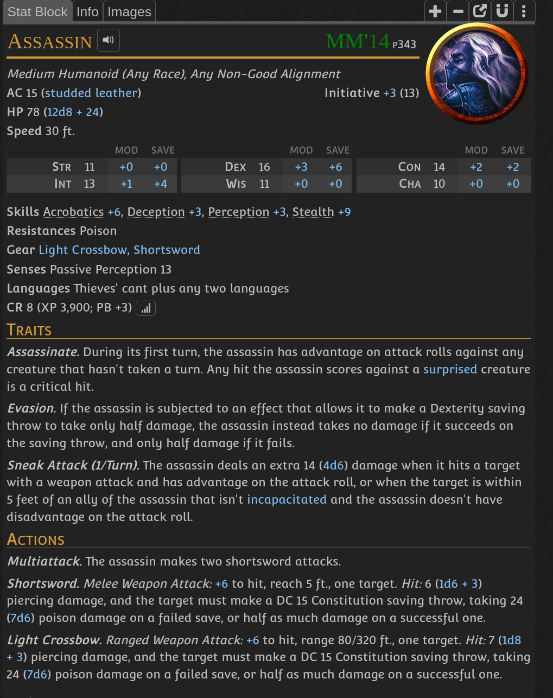
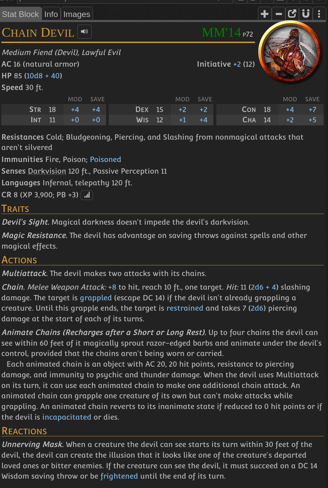
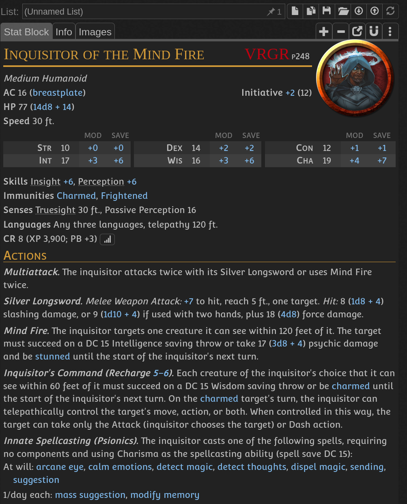
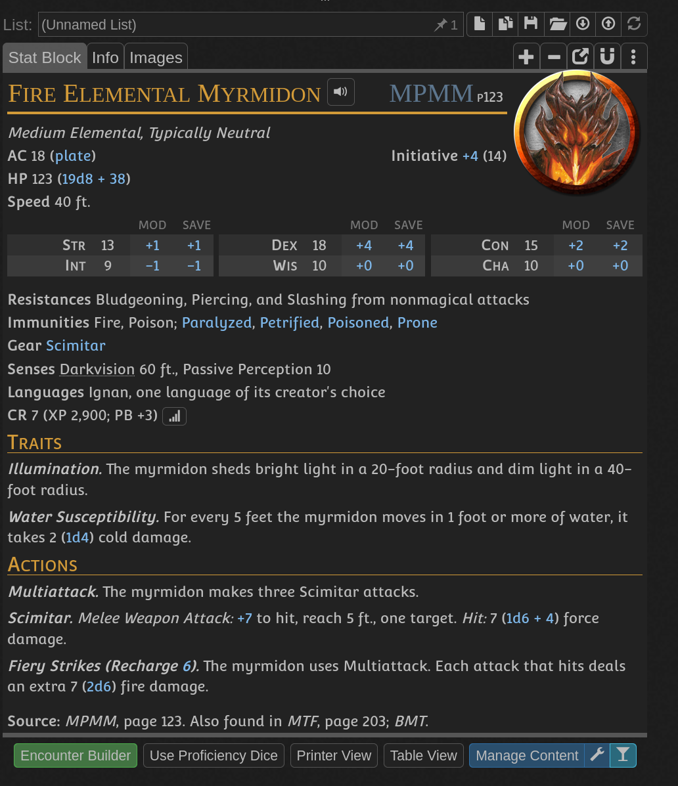
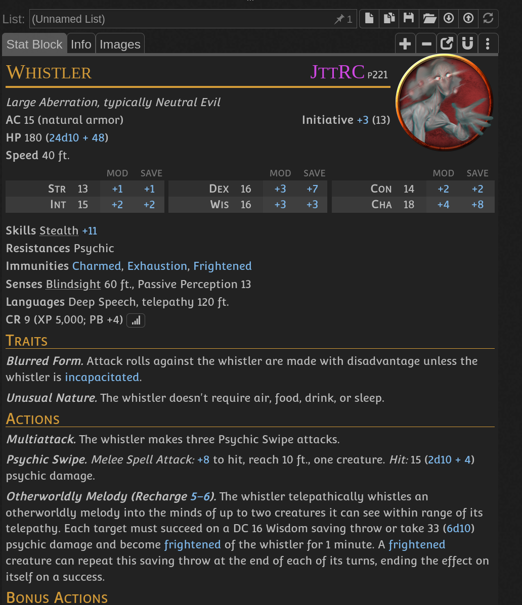

- See [[blue jam bottles quest]]
- Consists of 6 levels
	- 1st level - entrance, personal rooms, washing room with jars - 1400 small jars located here, dexterity(stealth) check if attract monsters or not
	- 2nd level - library, laboratory
		- contains manuscripts describing sons of [[Julian Bas]]
			- [[King mark]]
			- [[Cedric]], [[Arden]], [[Ryker]], [[Zarek]]
	- 3rd level - cages, operation room
		- contains [[blood distillator]]
		- instructions on how to use it
	- 4th level - incenerator and more cages -
	- 5th level - head master office and armory - some cool armor and weapons, few medkits, key to level 6
		- body of headmaster
		- manuscript describing Erebusa curse
			- King is only worthy of a dragon if and only if
				- He is ready to give his blood for it
				- He is supported by his brothers
				- People from other tribes are ready to give their blood for him
				- King has found his peace, love and lives a happy life
				- King has unity among Raffens, Tribes and Erebusa people under one roof
		- notebook about orzoek
			- tried to breed anti mages while being mages themselves
			- experiment went to well - we created ultimate mage killers
			- our next step is to create ultimate weapon, we will use him for our purpose!
				- we have succesfully destroyed creatures conscioness
				- we are trying to get control over creature, but we are not successfull so far
				- experiment is ongoing, but this creature is too strong!
			- outbreak - prisoners escaped and opened the cages
				- I have been fortunate enough to baricade myself into this room
				- I have broken all mirrors, they use them as doors
				- I can hear screams from the upstairs
				- I am running out of food and water
				- I will never see the sun again
			-
	- 6th level - sleeping corrupted Iron Claw, the ultimate weapon, entrance is huge gate closed by unbreakable magic
		- contains [[Eternal Tower Key]]
		- experiment went wrong, Corrupted Iron Claw is uncontrollable beast that only wants to kill
		- it's sleeping and chained, chains got rusty from time
		- presence of meat awakens him, he breaks rusty chains and is ready to kill, roll initiative
		- if you fail to kill it - it's going to start destroying and eating
			- Agatha's orchad on day 1
			- Laminaria on day 2
			-
		-
		-
- Built to produce combat mutants through necromantic experiments
-
- The idea was to make a mutant that is capable of taking down mages, basically a mage killer
	- The creature has no eyes or ears, big mouth full of venomous teeth and sharp claws. It looks like humanoid with almost glowing white skin. It has not seen sun and despises it
	- soldier - close combat version - attacks with claws and teeth
	- 
	- werper - telekinetic monster, fully imune to magical attacks
	- 
	- psychonaut
	- 
	- fire mutant
	- 
	- 
	-
-