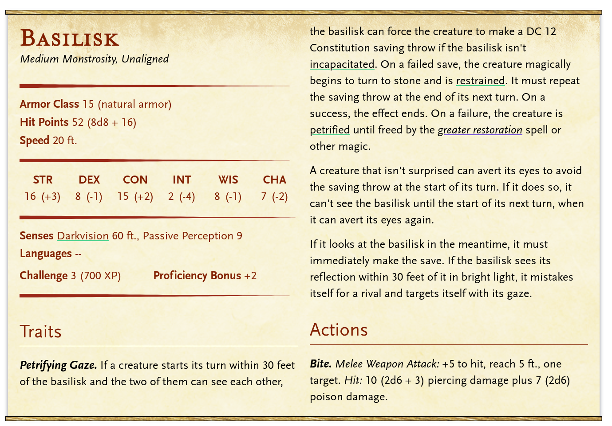
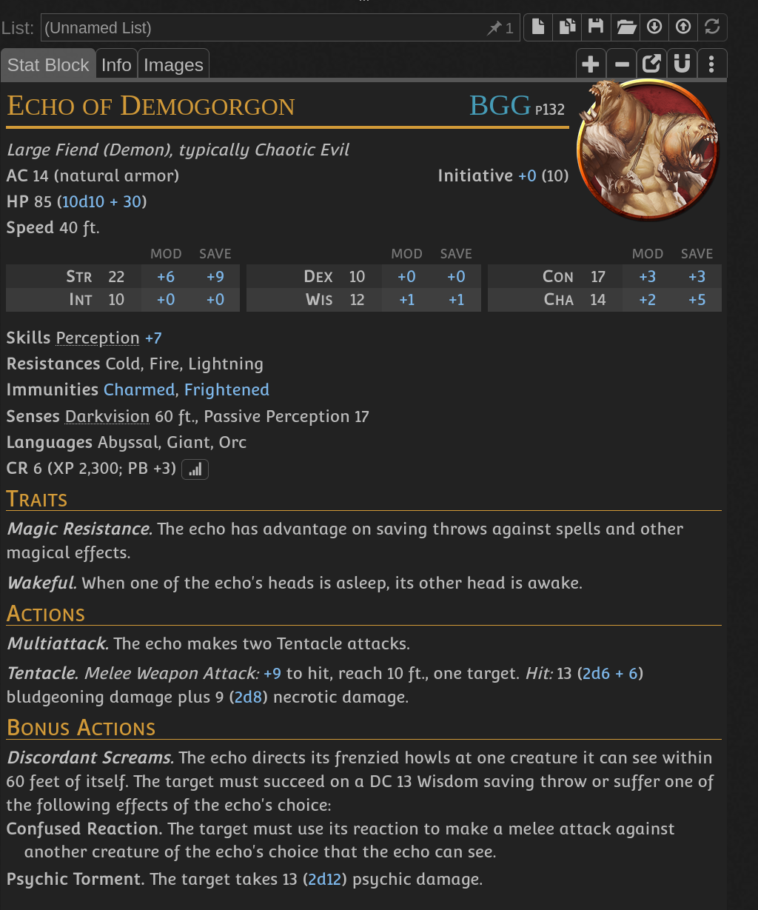
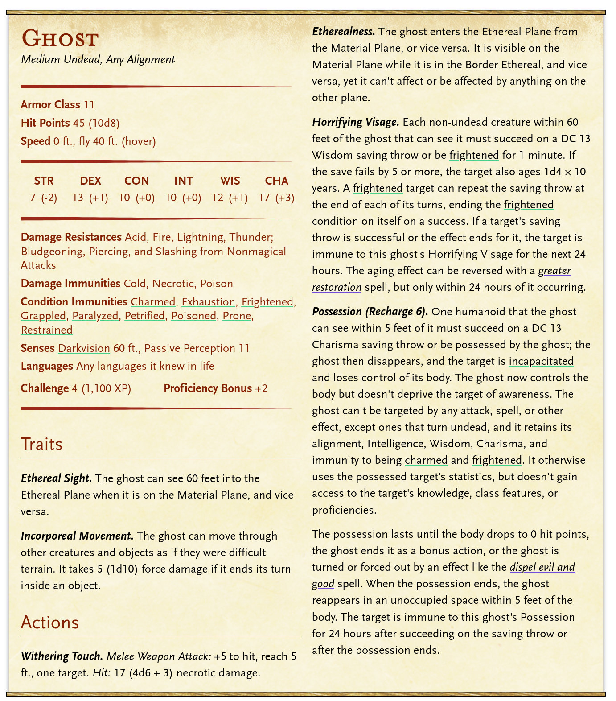
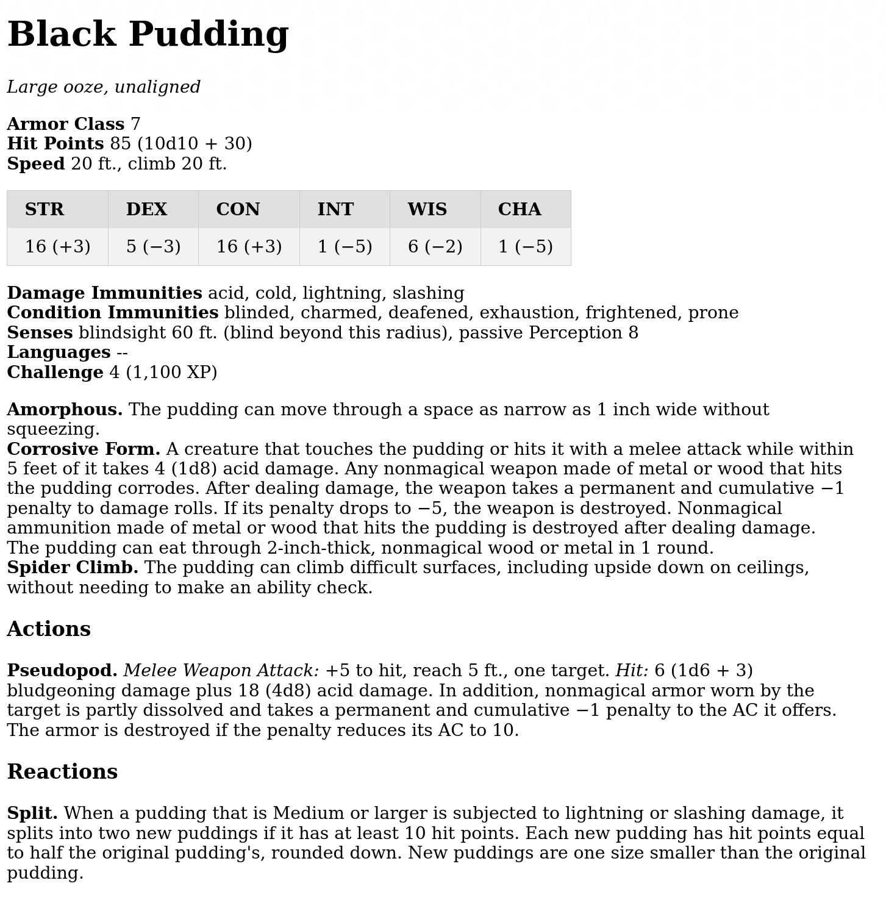
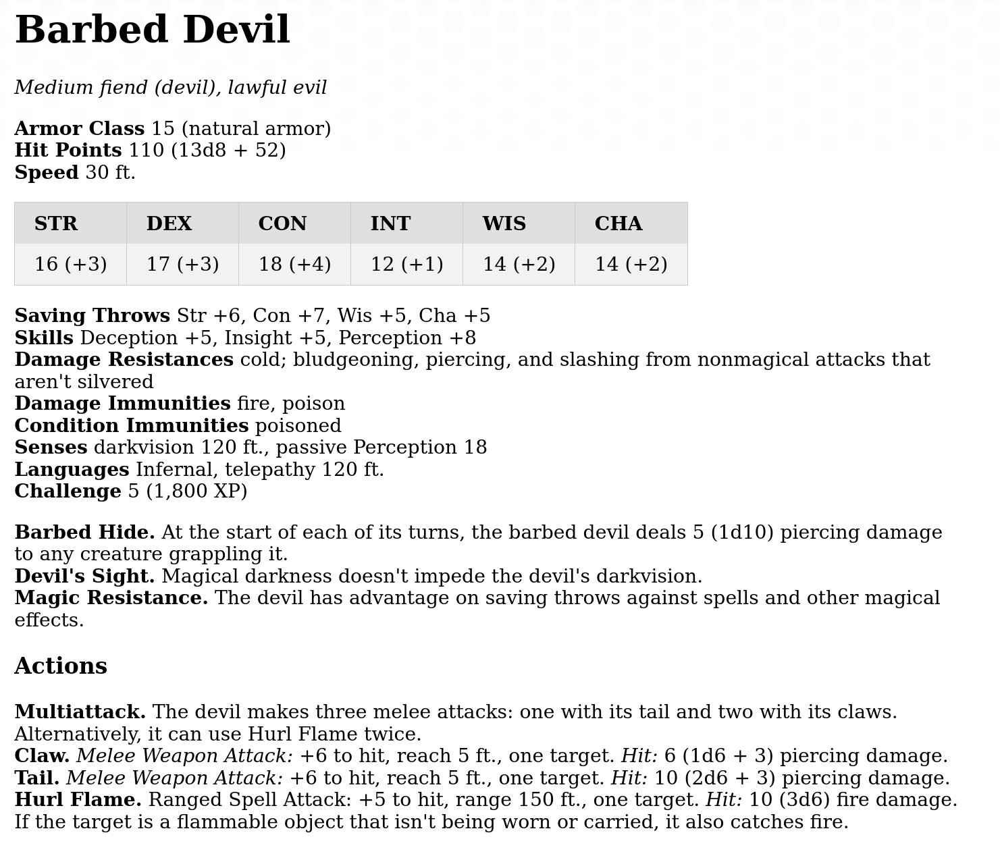
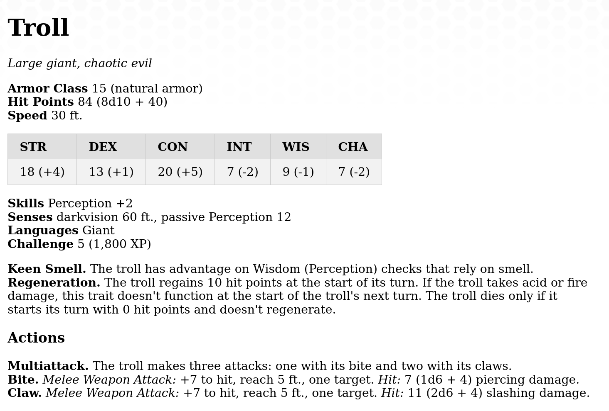
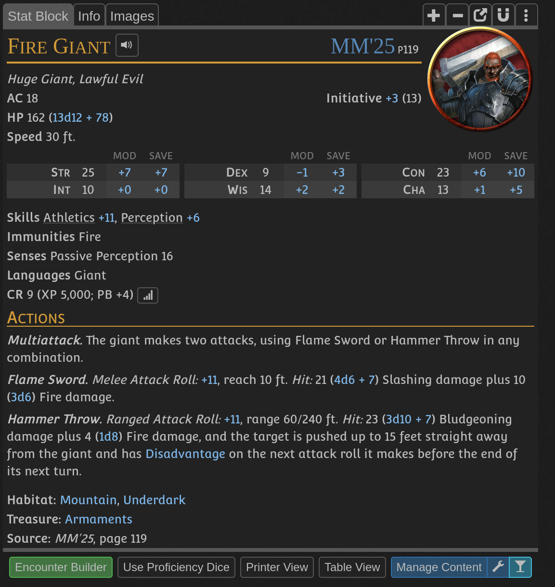

- Contains goliath village named [[Rokfal]]
- labyrinth monsters:
	- 1 - 
	- 2 - 
	- 3 - 
	- 4 - 
	- 5 - 
	- 6 - 
	-
- Everybody runs, all red dots disappear
- Face the Balor, fire deamon
-
- 
- Blue stone is surrounded by 600 gold worth of other stones