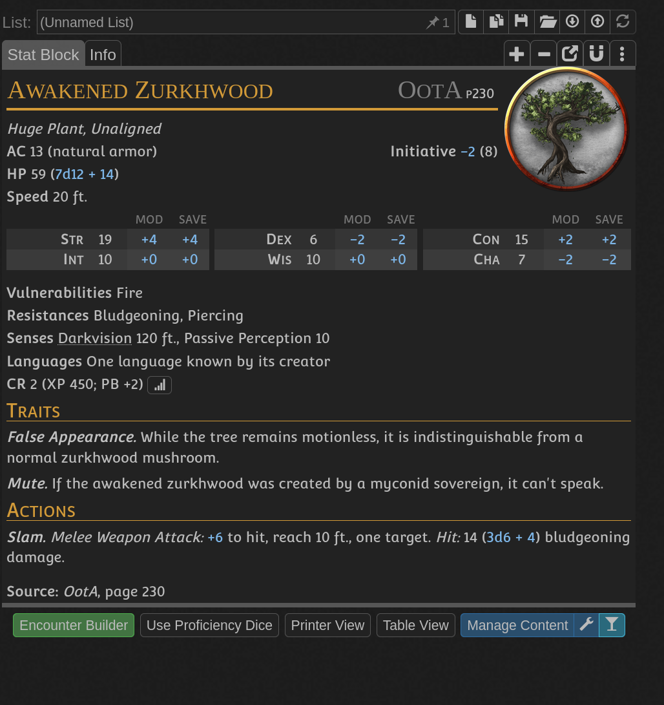

- Carlo Snijder had no children and one day he stole magical book from traveling wizard [[Walter LaBlanc]]
- Comes regularly at the [[Laminaria market]]
- He made a boy out of wood, this was 6 years ago - Woddy has been "born"
- Woddy had no friends and watched father carving out of wood beautiful furniture
- Woddy wanted to grow and wanted friends. One day he asked this from Carlo and he killed him when he refused
- Woddy made himself friends, Alan and Harlene - 2 more with the same stats
- Woddy is of habit of cutting faces out of his victims in order to look like real teenager
- [battlemap](../battle_maps/carlo_house.xcf)
- 
- After searching the sawmill heroes can find huge pentagram at the side house with a book in the center
	- Attic also contains sewing machine and severed faces, that's where Woody and friends live
	- Book can be sold to [[Walter LaBlanc]] for 200 gold