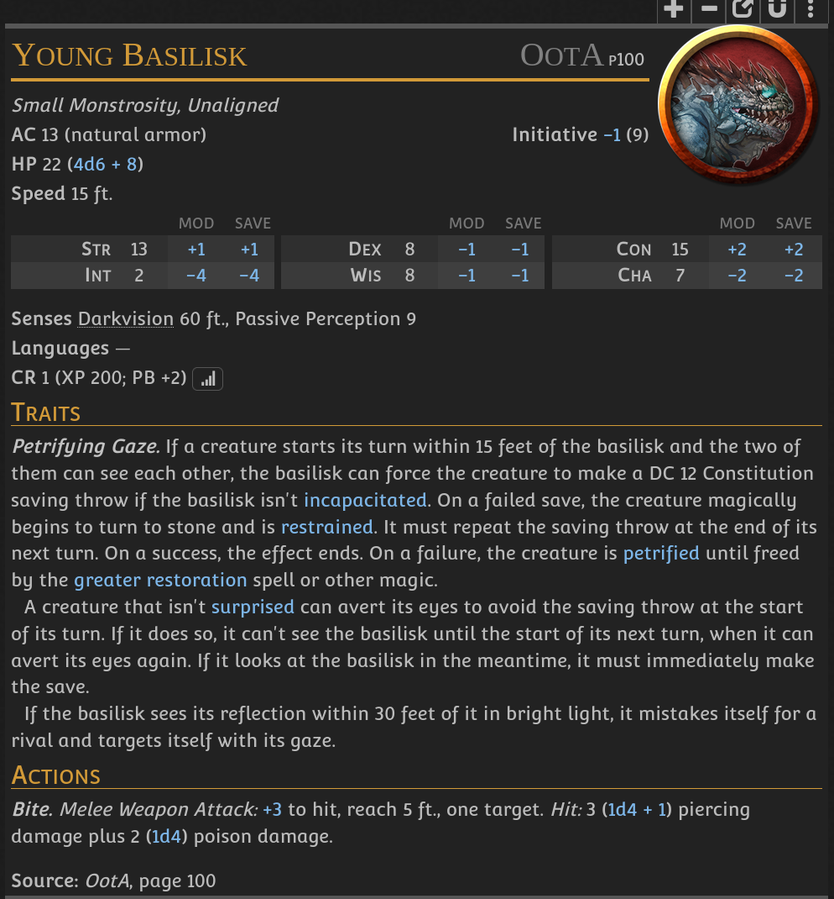
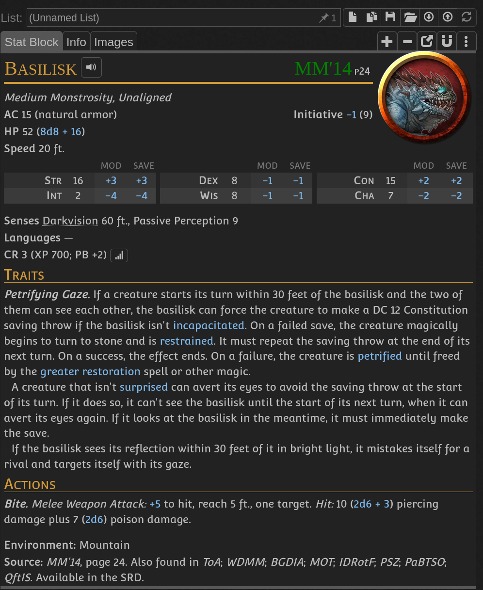

- Reward is 150gp for a live basilisk
- Fresh basilisk blood can be used to craft antidote for the son of [[Herberg chief Louis Garen]] bitten by baby basilisk
- Basilisk has settled on one of the farms cellars on west side of [[Herberg]]
- [battlemap](./battle_maps/basilisk_cellar.xcf)
-
- 
- 
-