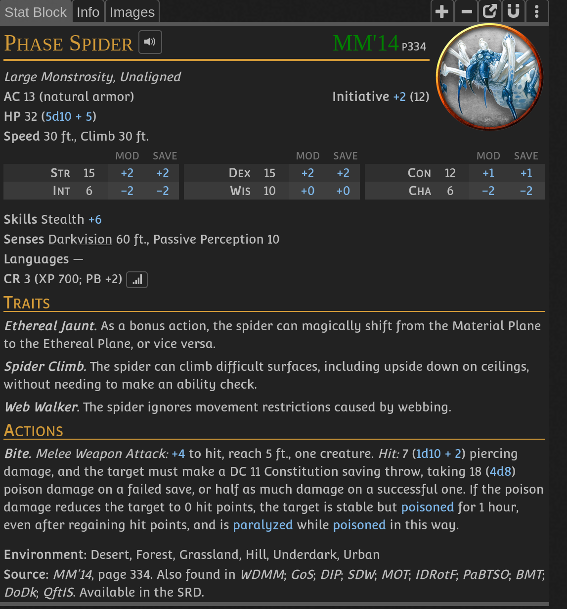
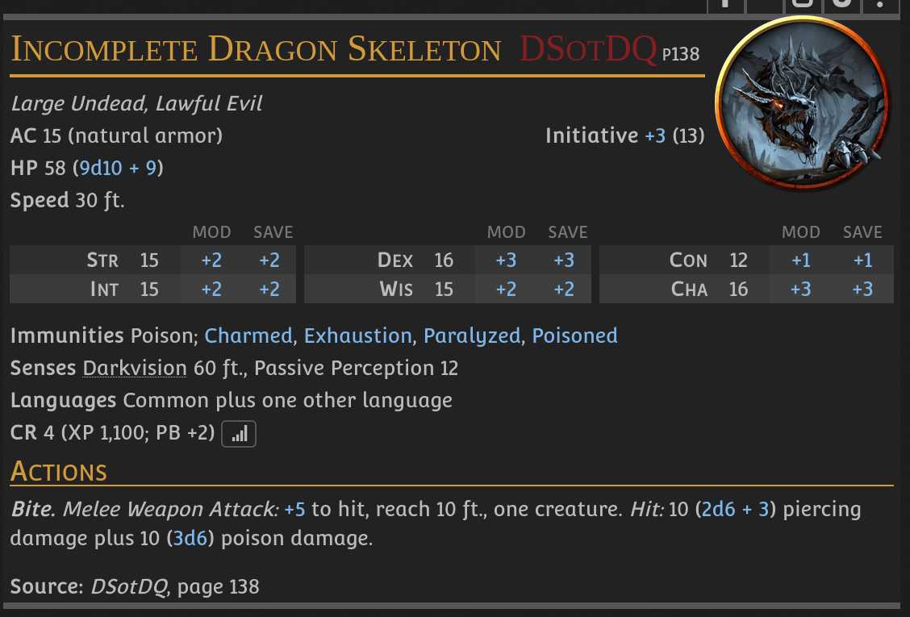

- Fabien is a member of [[Iron Claw cult]] and wishes to ressurect the dragon
- He has found a book about dragon that sleeps in the sea, he is gathering ingredients to ressurect him.
- He is missing legs of Phase spider
- 
- Spider lives in [[Tenebrous wood]]
- After delivering spider legs Fabien raises the monster on the same night
- Part of a dragon that Iron Claw has fought rises form the sea
- 
- He is threatening to destroy [[Laminaria]]