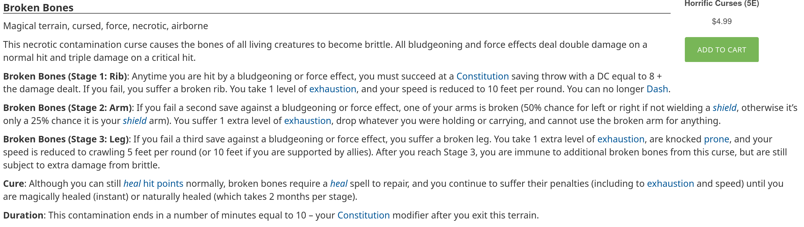
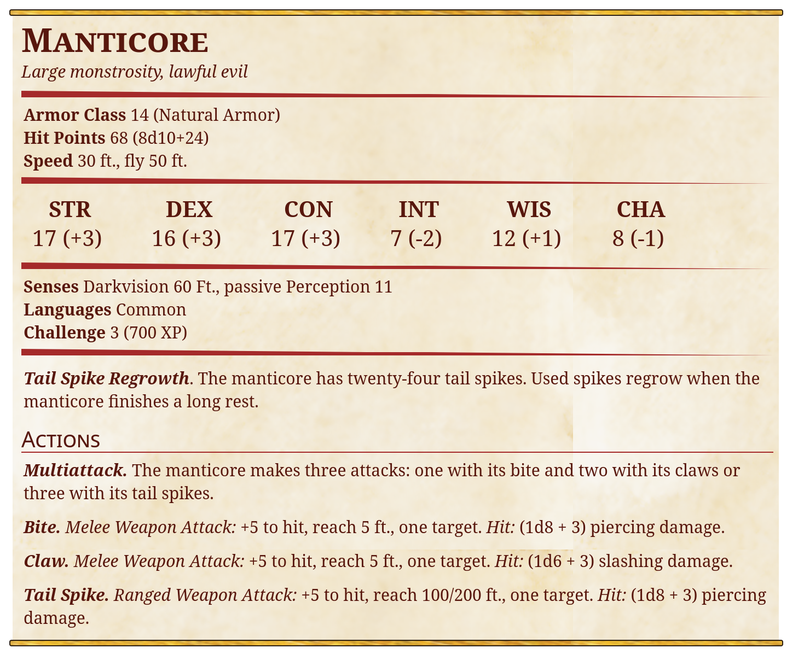

- Dropped 25 years ago
- Is made from black wood with stone elements
- A ship guarded by Manticoras (3 pieces)
- has 3 levels
	- middle level
		- captains logbook hidden on the middle level with remaining tresures - 400 gold
		- a strange looking device with remnants of dragon heart pierced by sword
	- lowest level
		- contains skelletons, some of them still chained in the cages
		- one of the skelletons is chained in a small cage for single person
			- has golden decorations - 150 gold worth
			- most likely was woman, priest, was healer cought into captivity. Cursed the gold
			- if you take the gold -
			- 
			-
			-
			-
		-
- this ship can fly, this information is available from logbook which is hidden in the chest at the middle level
- It has been powered by dragon's heart.
- Contains huge sacrificial stone in the middle of the ship, from there blood has been dripping onto the heart
- At some point slaves attempted to escape and managed to pierce dragons heart with a sword, "killing" it
- Escaping slaves have been killed by the crew. Ship dropped in [[woestijn]] and crew escaped in unknown direction
- Slaves can be purchased from the tribes encampment. 20 people - farmers who had no money to pay. Price is 500 gold.
- 
-