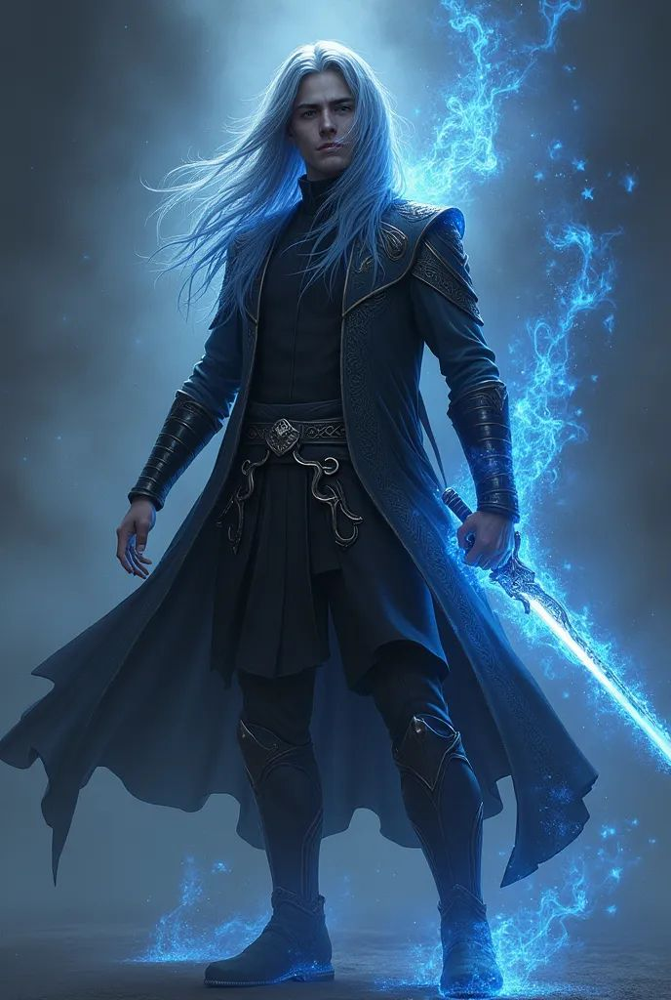

- 
- 
- He is a lier, he lies about everything, including his orientation. After
  that situation with Dylan he never tried again to be with anyone.
- —
  here I need your help. I need a good/neutral male character during the 
  game with whom Therion can fall in love with. It doesn’t matter if the 
  character has mutual fillings or not, but this whole dynamic of their 
  interactions should help Therion to become better.
- In reality he is an abandoned child, he grew up in poverty in an 
  orphanage. He was given there his one and only (nick)name - Inky, 
  because he had inky blue streaks in his hair. Every time Inky became 
  angry this streaks began to glow.
  When he turned 15 years old he fell
   in “love”/passion for the first time with his classmate dwarf Dylan. 
  Dylan thought it was unnatural and pathetic and refused Therion’s 
  intentions. At that moment Therion felt so angry and embarrassed . His 
  hair turned into a blue fire (like Hades), the fire also bursted from 
  his hands and burned Dylan a little and some other kids too.
  He was abandoned from the orphanage. Everyone thought he had a curse.
  His
   good constitution and noble appearance allowed him to create a new 
  story about himself. He learned how to lie and realised that this is a 
  great tool to get what he wants and be what he wants to be.
- Therion claims to be from a very rich and famous DnD family - Oberon.
  Having
   all this fame and glory on the continent he became tired of it. He 
  wants to conqueror new lands and he is looking forward for new feelings 
  and experiences, far away from his famous family and all its riches.
  However, this is a lie…
- No preference! This character just needs to be long enough in the 
  campaign (can be on and off, some merchant or just a person in a 
  tavern). My character will require some time to develop a true love to 
  him :)
- And btw, he has a love-hate relationship with his magic. He always 
  thought that his parents abandoned him because he was cursed. Magic also
   scared people away from him, like Dylan, for example.
  He doesn’t want to use it at all! But when he does… it feels soooo goood !🫠that he cannot stop
  Basically, he is a magic addict