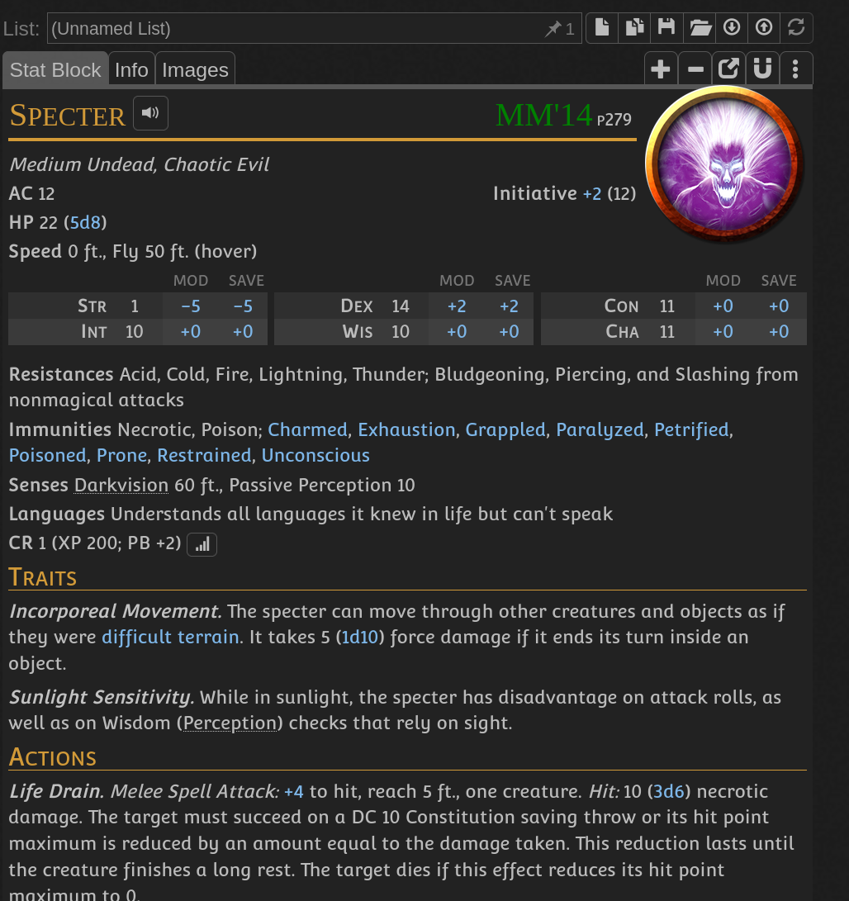
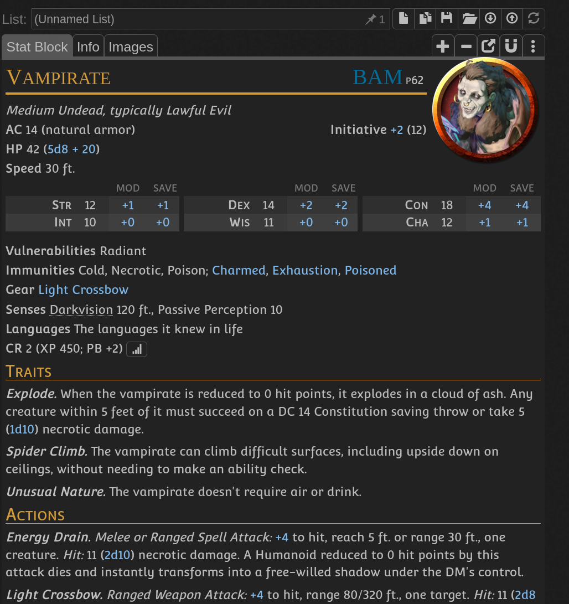

- Laminaria Inn is building nr 140, making the room number 1408
- Room will attempt to kill guests
- One day heroes wake up in the room and the door is not there
- When they look outside they see previous house with bright number "marketplaats 139"
- Ghosts will appear every 10 minutes to torture them (TODO: ghost stats)
- Room has bookshelf with numerous books, one of them contains a key that will lead to a boss fight (TODO: boss ghost stats)
- One of the bookshelfs has selection of books by Steven Koning
- Paintings in the room's wall in order show
	- Farm on fire - 8 - rescue 8 women by opening right door, wrong door means fighting specter. It's 4 doors
	- Sinking ship - 4 - rescues 4 sailors by killing vampirate
	- Snow desert - 1 - rescue winter fox by warming it up and feeding it
- After finishing all paintings - a hose appears in the room - symbolizes 0 - when looking at the shadow casted by the hose you see only the ring
- At the book number 8 by Steven Koning, page 410 will have a key to the door
- After opening the door boss fight encounter starts, its completely dark space.
- 
-
- 
-